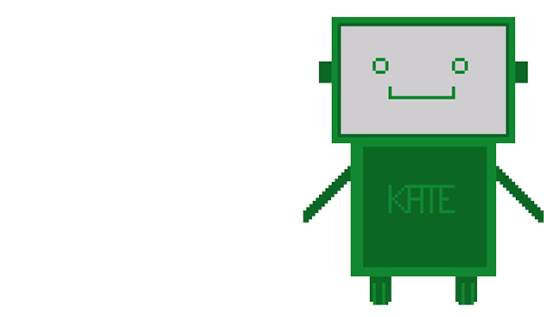
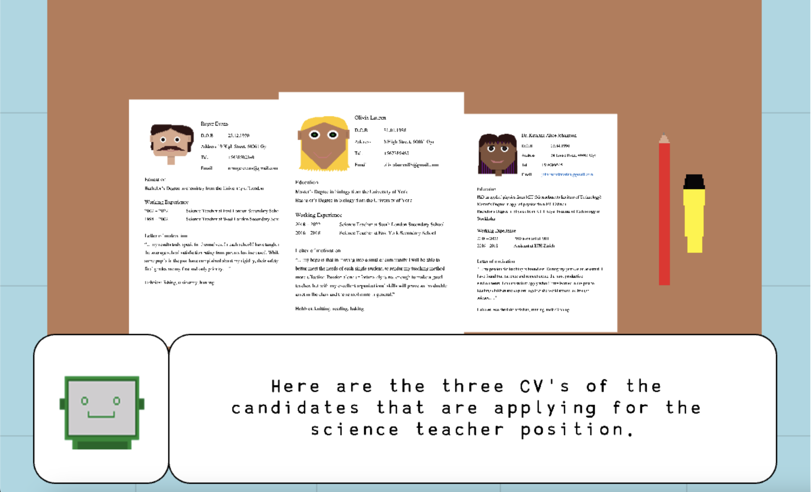
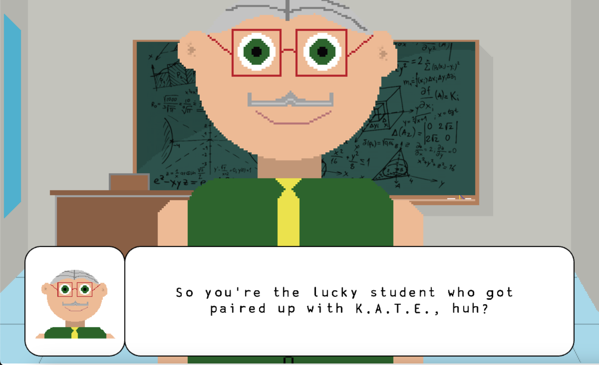

# b.I.A.s

## Description du projet
Ce projet est un jeu de dialogue en 2D de type RPG avec un sous-jacent pédagogique. Le joueur incarne le rôle d'un étudiant dans une école anglaise fictive qui est à la recherche d'un nouveau profeseur de sciences. Le joueur est chargé d'accompagner une IA appelée K.A.T.E. dont le but est de suggérer le meilleur candidat possible pour le poste. K.A.T.E. doit recueillir des informations auprès des professeurs actuels ainsi que le directeur de l'école pour faire sa proposition. Le joueur sera-t-il d'accord avec sa décision finale ? 

## Sources
CRAWFORD, K. 'Categorisation', in _Atlas of AI: power, politics, and the planetary costs of artificial intelligence_, Yale University Press, 2021.

* boyd, d. et Crawford, K. 2012. 'Critical questions for big data', in _Information, Communication & Society_, vol. 15, n°5, pp 662–679.

## Objectif du jeu
Ce projet vise à sensibiliser un jeune public aux notions de base entourant les préjugés dans l'intelligence artificielle. L'un des principaux aspects des controverses soulevées récemment au sujet de l'intelligence artificielle porte sur les préjugés. Kate Crawford a consacré une grande partie de sa carrière à l'étude de ces controverses et a offert une perspective nouvelle sur la manière dont ces biais apparaissent et se manifestent dans l'IA. En effet, dans un chapitre de son livre _Atlais of AI : power, politics, and the planetary costs of artificial intelligence_, elle explique comment l'acte de catégoriser des objets ou des personnes lors de la création d'ensembles de données à partir desquels l'IA peut apprendre constitue un "acte de pouvoir" dans la mesure où il est le reflet des mœurs, des croyances et des pratiques de la société - qu'elles soient positives ou négatives. Ce n'est pas l'IA qui crée spontanément des préjugés, elle ne fait que refléter ceux de la société. 

## Processus de Développement
Ce jeu a été conçu à l'origine comme un jeu de fiction interactif à développer dans Inky. Finalement, nous avons décidé que nous voulions inclure l'interactivité avec un environnement global, et nous avons choisi de faire le jeu en Kaboomjs à la place.

Alors que le codage a été partagé équitablement entre nous, l'illustration (arrière-plan, portraits, CVs, sprites) du jeu a été faite à partir de zéro par Tessa en utilisant un programme de pixel art. Les dialogues ont été écrits par Sophie. L'intrigue du jeu et la narration principale ont été élaborées en collaboration.

## Contrôles et browser
Contrôles : barre d'espace pour interagir (dialogues) + flèches pour se déplacer sur la carte
Ce jeu est pour le moment jouable uniquement sur Google Chrome

## **outils utilisés**
- Ce projet a été réalisé en utilisant Kaboomjs et Visual Studio Code.

- Ce projet est le fruit d'un travail collaboratif réalisé en personne et en utilisant l'extension Live Share de Visual Studio Code. Les taux d'engagement ne sont donc pas représentatifs de la répartition globale du travail, car ils ont été effectués par la personne qui a lancé l'application Live Share pendant les sessions de collaboration. 

## Contexte de développement
Ce projet a été développé dans le cadre du cours "Jeu vidéo 2D" (printemps 2022) enseigné par le Prof. Isaac Pante (SLI, Lettres, UNIL).

## Links
- Version anglais : https://github.com/s-abrown/2DVideoGame
- Page itch : https://t-cat.itch.io/bias-fr